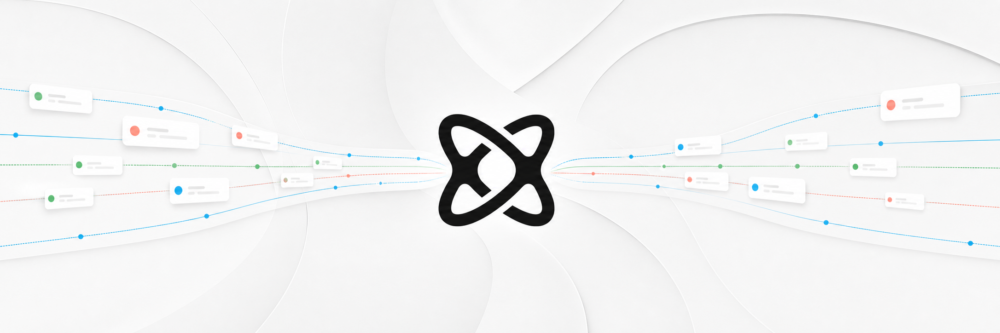
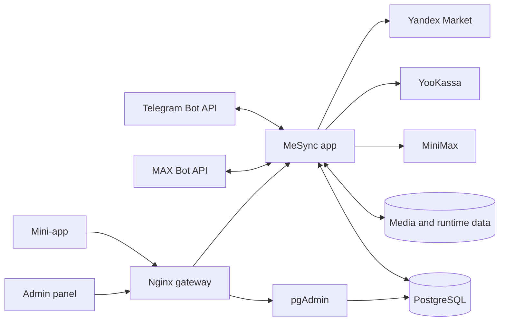

<p align="center">
  
</p>

# MeSync

MeSync синхронизирует сообщения и посты между групповыми чатами и каналами MAX и
Telegram. Пользователь подключает источники, создаёт одно- или двунаправленные правила,
а сервис переносит сообщения в заданном порядке, сохраняет форматирование и медиа,
учитывает трафик и состояние подписки.

В один production-процесс входят оба бота, control API, пользовательская mini-app,
админ-панель и фоновые задачи. Docker Compose дополнительно запускает PostgreSQL,
pgAdmin и внутренний Nginx gateway.

## Возможности

- синхронизация MAX -> Telegram, Telegram -> MAX, MAX -> MAX и Telegram -> Telegram;
- групповые чаты, каналы и темы Telegram;
- текст, форматирование, альбомы, фото, видео, файлы и поддерживаемые вложения;
- сохранение порядка доставки, защита от циклов и повторов, обработка правок и удалений;
- управление источниками и правилами через mini-app;
- подписки, автопродление, коды активации, индивидуальные тарифы и бессрочные пакеты трафика;
- приём платежей через ЮKassa и выдача цифровых кодов через Яндекс Маркет;
- стоп-словарь, MiniMax-классификация, жалобы и ручная модерация;
- админ-панель для аккаунтов, подписок, кодов, трафика, рассылок, настроек и аудита;
- PostgreSQL, pgAdmin и резервное копирование из админ-панели.

Внешние интеграции независимы. Пустые токены Telegram/MAX, ключи ЮKassa, MiniMax или
Яндекс Маркета не мешают запустить API, интерфейсы, PostgreSQL и pgAdmin.

## Архитектура



| Путь | Назначение |
| --- | --- |
| `src/` | Backend, control API, Telegram/MAX, биллинг и модерация. |
| `run_app.py` | Единый production entrypoint: оба бота, API и фоновые задачи. |
| `web/` | Пользовательская React/Vite mini-app и публичная посадочная страница. |
| `admin/` | React/Vite админ-панель. |
| `compose.yaml` | PostgreSQL, pgAdmin, приложение и gateway. |
| `deploy/` | Gateway, pgAdmin и опциональный локальный Telegram Bot API. |
| `tests/` | Backend и интеграционные regression-тесты. |
| `docs/` | Локальные копии документации Telegram, MAX, ЮKassa и MiniMax. |

## Установка из Docker Hub

Готовый образ приложения опубликован в приватном репозитории
[`oligovit6/mesync`](https://hub.docker.com/r/oligovit6/mesync). Это самый быстрый способ
установки: Python и frontend собирать на сервере не требуется.

Опубликованный образ содержит сервис `app`. PostgreSQL, pgAdmin и Nginx gateway запускаются
из `compose.yaml`, поэтому deployment-файлы проекта всё равно нужно получить из GitHub.
Текущая публикация поддерживает `linux/amd64`; на ARM используйте локальную сборку.

### 1. Доступ к приватному образу

Владелец репозитория должен предварительно предоставить вашему Docker Hub аккаунту доступ.
Авторизуйтесь на сервере:

```bash
docker login
```

На headless-сервере Docker покажет одноразовый код и адрес
`https://login.docker.com/activate`. При входе по username используйте Docker Hub personal
access token вместо пароля и не записывайте credential в `.env` или Compose.

Проверьте доступ отдельным pull:

```bash
docker pull oligovit6/mesync:sha-d474db95633f
```

Ошибки `pull access denied`, `insufficient_scope` или `repository does not exist` обычно
означают, что выполнен вход не в тот аккаунт либо этому аккаунту не выдан доступ к private
repository.

### 2. Получение deployment-файлов

```bash
git clone https://github.com/omazda/mesync.git mesync
cd mesync
cp .env.example .env
chmod 600 .env
```

### 3. Настройка окружения

Сгенерируйте два разных пароля:

```bash
openssl rand -hex 32
openssl rand -hex 32
```

Заполните как минимум следующие строки `.env`:

```dotenv
MESYNC_IMAGE=oligovit6/mesync@sha256:6158fa69b8375b6fa922f6955af18484d0fc6d01d9a17505303dcaa36c9c9315
MESYNC_POSTGRES_PASSWORD=<СЛУЧАЙНЫЙ_ПАРОЛЬ_БД>
MESYNC_ADMIN_PASSWORD=<ДРУГОЙ_СЛУЧАЙНЫЙ_ПАРОЛЬ>
MESYNC_APP_URL=http://localhost:8090
```

Для production замените `MESYNC_APP_URL` на публичный HTTPS URL без завершающего `/`.
Токены ботов и внешних интеграций можно добавить сразу или после первого запуска.

Рекомендуется закреплять образ по digest, как в примере выше: такой адрес всегда выбирает
ровно проверенный артефакт. Доступны также более удобные, но изменяемые теги:

| Ссылка | Назначение |
| --- | --- |
| `oligovit6/mesync:latest` | Последняя опубликованная версия. |
| `oligovit6/mesync:sha-d474db95633f` | Версия, собранная для Git revision `d474db95633f`. |
| `oligovit6/mesync@sha256:6158fa...c9315` | Точное неизменяемое содержимое текущего образа. |

### 4. Проверка и запуск без сборки

```bash
docker compose config --quiet
docker compose pull
docker compose up --detach --no-build
```

Флаг `--no-build` принципиален: он гарантирует, что Compose использует образ из
`MESYNC_IMAGE`, а не собирает `mesync:local` из исходников.

Дождитесь готовности и проверьте установку:

```bash
docker compose ps
curl --fail --silent --show-error --retry 30 --retry-all-errors --retry-delay 2 \
  http://127.0.0.1:8090/api/health
docker compose logs --tail=100 app
```

В `docker compose ps` сервисы `db`, `app`, `pgadmin` и `gateway` должны перейти в
`healthy`, а health endpoint должен вернуть `"storage":"postgresql"`.

Проверить фактически используемый образ можно так:

```bash
docker compose images app
docker image inspect "$(docker compose images --quiet app)" --format '{{json .RepoDigests}}'
```

После запуска доступны mini-app на `/`, админ-панель на `/admin/` и pgAdmin на
`/admin/psql/`. Первый вход и production HTTPS описаны в общих разделах ниже.

### 5. Обновление и откат Docker Hub-образа

Перед обновлением сделайте backup. Для `latest`:

```bash
docker compose pull app
docker compose up --detach --no-build app
curl --fail --silent --show-error --retry 30 --retry-all-errors --retry-delay 2 \
  http://127.0.0.1:8090/api/health
```

При закреплении по digest сначала замените `MESYNC_IMAGE` в `.env` на digest новой
публикации, затем выполните те же команды. Для отката верните предыдущий digest и повторно
запустите `pull app` и `up --no-build app`. Persistent volumes при смене app-образа не
удаляются.

## Установка с локальной сборкой

Этот способ собирает оба frontend-приложения и Python backend в локальный образ
`mesync:local`. Он нужен для ARM-сервера, разработки или запуска ещё не опубликованных
изменений.

### 1. Требования

Нужны:

- Linux-сервер или другая система с Linux containers;
- актуальные Docker Engine и Docker Compose v2 с командой `docker compose`;
- `git`, `curl` и `openssl` на хосте;
- исходящий доступ к Docker Hub, npm/PyPI при первой сборке и API включённых интеграций;
- свободный TCP-порт `8090` либо другой порт, заданный в `.env`.

Проверка инструментов:

```bash
docker --version
docker compose version
git --version
curl --version
openssl version
```

Путь установки ниже повторно проверен 16 июля 2026 года на Docker Engine 29.6.1 и
Docker Compose 5.2.0: новый стек с пустыми токенами поднял четыре healthy-сервиса,
PostgreSQL и pgAdmin инициализировались с нуля, а HTTP и backup/restore проверки прошли.
Это проверенный baseline, а не требование использовать именно эти версии.

Compose использует inline config и health-зависимости сервисов. Если команда
`docker compose config --quiet` из шага 4 не поддерживается или возвращает ошибку
неизвестного поля, обновите Docker Compose.

### 2. Получение проекта

```bash
git clone <URL_РЕПОЗИТОРИЯ> mesync
cd mesync
cp .env.example .env
chmod 600 .env
```

Не коммитьте `.env`: он содержит пароли, токены и платёжные ключи и уже добавлен в
`.gitignore`.

### 3. Обязательная конфигурация

Сгенерируйте два разных секрета:

```bash
openssl rand -hex 32
openssl rand -hex 32
```

Запишите первое значение в `MESYNC_POSTGRES_PASSWORD`, второе в
`MESYNC_ADMIN_PASSWORD`. Не оставляйте в файле угловые скобки или примерные значения.

Минимально необходимые строки `.env`:

```dotenv
MESYNC_POSTGRES_PASSWORD=<СЛУЧАЙНЫЙ_ПАРОЛЬ_БД>
MESYNC_ADMIN_PASSWORD=<ДРУГОЙ_СЛУЧАЙНЫЙ_ПАРОЛЬ>
MESYNC_APP_URL=http://localhost:8090
```

| Переменная | Обязательность | Назначение |
| --- | --- | --- |
| `MESYNC_POSTGRES_PASSWORD` | Всегда | Пароль PostgreSQL. Compose не стартует без него. |
| `MESYNC_ADMIN_PASSWORD` | Всегда | Вход в админ-панель и резервный пароль pgAdmin. |
| `MESYNC_APP_URL` | Для production | Публичный HTTPS URL без завершающего `/`. |
| `MESYNC_PGADMIN_EMAIL` | Необязательно | Email входа в pgAdmin, по умолчанию `admin@mesync.app`; нужен валидный публичный домен. |
| `MESYNC_PGADMIN_PASSWORD` | Необязательно | Отдельный пароль pgAdmin; иначе используется админ-пароль. |
| `TELEGRAM_BOT_TOKEN` | Для Telegram | Токен Telegram-бота; пустое значение выключает бота. |
| `MAX_BOT_TOKEN` | Для MAX | Токен MAX-бота; пустое значение выключает бота. |

Для локальной проверки токены ботов можно оставить пустыми. Приложение запустит API,
frontend, админ-панель, PostgreSQL и pgAdmin и запишет в лог, что оба бота отключены.

### 4. Проверка Compose-конфигурации

```bash
docker compose config --quiet
```

Успешная команда ничего не выводит и возвращает код `0`. Ошибка вида
`Set MESYNC_POSTGRES_PASSWORD` или `Set MESYNC_ADMIN_PASSWORD` означает, что обязательное
значение осталось пустым либо Compose читает не тот env-файл.

Для отдельного стенда можно использовать другой файл:

```bash
MESYNC_ENV_FILE=.env.staging docker compose --env-file .env.staging config --quiet
MESYNC_ENV_FILE=.env.staging docker compose --env-file .env.staging up --detach --build
```

`--env-file` задаёт переменные подстановки самого Compose, а `MESYNC_ENV_FILE` передаёт
тот же файл контейнеру `app`; для нестандартного файла нужны оба параметра.

### 5. Сборка и первый запуск

```bash
docker compose up --detach --build
docker compose ps
docker compose logs --tail=100 app
```

Первый запуск скачивает базовые образы и собирает Python/Node зависимости, поэтому может
занять несколько минут. Дождитесь состояния `healthy` у `db`, `app`, `pgadmin` и
`gateway`. Gateway запускается только после готовности приложения и pgAdmin.

Проверьте API:

```bash
curl --fail --silent --show-error http://127.0.0.1:8090/api/health
```

Ожидаемый ответ имеет вид:

```json
{"ok":true,"ts":1234567890,"storage":"postgresql"}
```

Если в `.env` изменены `MESYNC_DOCKER_BIND` или `MESYNC_DOCKER_PORT`, используйте в
проверке соответствующий адрес и порт.

### 6. Первый вход

После успешного healthcheck доступны:

| Адрес | Назначение | Данные входа |
| --- | --- | --- |
| `http://127.0.0.1:8090/` | Посадочная страница и mini-app | Вход пользователя из MAX/Telegram. |
| `http://127.0.0.1:8090/admin/` | Админ-панель | `MESYNC_ADMIN_PASSWORD`. |
| `http://127.0.0.1:8090/admin/psql/` | pgAdmin | `MESYNC_PGADMIN_EMAIL` и pgAdmin-пароль. |
| `http://127.0.0.1:8090/legal/` | Оферта и политика | Без авторизации. |
| `http://127.0.0.1:8090/docs` | OpenAPI UI | Без авторизации; не публикуйте отдельно. |

При первом старте pgAdmin автоматически создаёт подключение `MeSync PostgreSQL` к
`db:5432`. Пароль базы получает локальный password-exec helper, поэтому он не хранится в
`servers.json`.

### 7. Финальная проверка установки

```bash
docker compose ps
curl --fail --silent --show-error http://127.0.0.1:8090/api/health
curl --fail --location --output /dev/null http://127.0.0.1:8090/
curl --fail --location --output /dev/null http://127.0.0.1:8090/admin/
curl --fail --location --output /dev/null http://127.0.0.1:8090/admin/psql/
curl --fail --location --output /dev/null http://127.0.0.1:8090/legal/
docker compose logs --tail=200 app
```

Установка считается исправной, если четыре сервиса имеют состояние `healthy`, health
возвращает `ok: true`, HTTP-команды завершаются без ошибки, а в логе нет необработанного
исключения или постоянных перезапусков. Предупреждения о пустых токенах ожидаемы, если
соответствующие боты намеренно не настроены.

## Публикация в production

Mini-app и внешние webhook-и должны использовать публичный HTTPS-адрес. По умолчанию
Compose слушает только `127.0.0.1:8090`; это безопасный upstream для Caddy, Nginx или
другого reverse proxy.

1. Направьте DNS-запись домена на сервер.
2. Оставьте `MESYNC_DOCKER_BIND=127.0.0.1`.
3. Задайте `MESYNC_APP_URL=https://mesync.example.com`.
4. Настройте TLS и reverse proxy на `127.0.0.1:8090`.
5. Пересоздайте `app` и проверьте публичный health endpoint.

Минимальный Caddyfile:

```caddyfile
mesync.example.com {
  reverse_proxy 127.0.0.1:8090
}
```

После изменения `.env`:

```bash
docker compose up --detach --no-deps --force-recreate app
curl --fail --silent --show-error https://mesync.example.com/api/health
```

Весь домен направляйте в `gateway`: путь `/admin/psql/` он отправляет в pgAdmin, а
остальные пути в приложение. Не публикуйте PostgreSQL `5432` или pgAdmin `5050` напрямую.
Значение `MESYNC_DOCKER_BIND=0.0.0.0` открывает посадочную страницу, API, админ-панель и
pgAdmin на всех интерфейсах, поэтому без внешнего firewall и TLS его использовать не стоит.

## Подключение Telegram и MAX

### Общая последовательность

1. Создайте ботов в кабинетах Telegram и MAX.
2. Укажите `TELEGRAM_BOT_TOKEN` и/или `MAX_BOT_TOKEN` в `.env`.
3. Укажите публичные ссылки `MESYNC_TG_BOT_URL` и `MESYNC_MAX_BOT_URL`.
4. Привяжите HTTPS URL из `MESYNC_APP_URL` как mini-app соответствующего бота.
5. Пересоздайте контейнер `app`.
6. Откройте диалог с каждым ботом и проверьте кнопку запуска приложения.
7. Добавьте бота в тестовый источник, выдайте права чтения/отправки и создайте правило.

```dotenv
TELEGRAM_BOT_TOKEN=<TOKEN_ОТ_BOTFATHER>
MAX_BOT_TOKEN=<TOKEN_ОТ_MAX>
MESYNC_TG_BOT_URL=https://t.me/<bot_username>
MESYNC_MAX_BOT_URL=https://max.ru/<bot_username>
MESYNC_APP_URL=https://mesync.example.com
```

Production entrypoint `run_app.py` всегда использует long polling. Переменные
`MODE`, `WEBHOOK_*`, `MAX_MODE` и `MAX_WEBHOOK_*` относятся к отдельным standalone
entrypoint-ам и не переключают Docker all-in-one процесс на webhook.

Не запускайте одновременно systemd и Docker с одинаковыми токенами. Telegram вернёт
конфликт `getUpdates`, а две копии любого бота могут нарушить порядок обработки.

Для Telegram-канала бот должен быть администратором; для публикации требуется право
`can_post_messages`. В группе бот должен видеть входящие сообщения и иметь право отправки:
назначьте его администратором либо настройте privacy mode в соответствии со сценарием.
После изменения прав состояние источника обновляется автоматически или после следующей
попытки доставки.

Локальные справочники по настройке mini-app:

- [Telegram Mini Apps](docs/telegram/markdown/11-webapps-miniapps.md)
- [MAX: создание mini-app](docs/max/markdown/help/miniapps.md)
- [MAX Bridge и запрос номера](docs/max/markdown/docs/webapps/bridge.md)
- [MAX: проверка launch parameters](docs/max/markdown/docs/webapps/validation.md)

### Локальный Telegram Bot API

Для файлов крупнее ограничений облачного Bot API используйте
`deploy/telegram-bot-api/README.md`. После запуска локального API добавьте в основной
`.env`:

```dotenv
COMPOSE_FILE=compose.yaml:compose.telegram-api.yaml
TELEGRAM_API_BASE=http://127.0.0.1:8081
TELEGRAM_API_DATA_DIR=/var/lib/telegram-bot-api
TELEGRAM_API_FILE_GID=101
```

Override подключает `app` к сети `telegram-bot-api_default`, заменяет loopback URL на
`http://telegram-bot-api:8081` и монтирует каталог файлов текущего бота read-only.
Healthcheck дополнительно проверяет доступ контейнера к этому каталогу. При облачном API
override не нужен.

## Конфигурация продукта

Все данные владельца и развёртывания задаются в `.env` и подставляются в backend,
mini-app, landing и admin при запуске.

| Переменная | Назначение |
| --- | --- |
| `MESYNC_BOT_NAME` | Единое отображаемое имя сервиса и ботов. |
| `MESYNC_BOT_AVATAR_URL` | HTTPS URL или уже встроенный root-relative путь к аватарке. |
| `MESYNC_APP_URL` | Публичный адрес сервиса без завершающего `/`. |
| `MESYNC_MAX_BOT_URL`, `MESYNC_TG_BOT_URL` | Ссылки на ботов; username вычисляется из URL. |
| `MESYNC_SUPPORT_TG_URL`, `MESYNC_SUPPORT_EMAIL` | Доступные пользователю каналы поддержки. |
| `MESYNC_LEGAL_PROVIDER_NAME_RU/EN` | Имя или наименование владельца legal-документов. |
| `MESYNC_LEGAL_TAX_ID` | ИНН владельца. |
| `MESYNC_LEGAL_REGISTRATION_ID` | ОГРНИП или другой регистрационный номер. |
| `MESYNC_LEGAL_TERMS_VERSION` | Текущая редакция оферты. |
| `MESYNC_LEGAL_PRIVACY_VERSION` | Текущая редакция политики конфиденциальности. |

Рекомендуемая аватарка: квадратный PNG или WebP `1024x1024`, минимум `512x512`, без
важных деталей у краёв. Для уже собранного Docker-образа используйте публичный HTTPS URL.
Root-relative файл должен находиться в `web/public/` до сборки образа.

После изменения runtime-параметров пересборка не нужна:

```bash
docker compose up --detach --no-deps --force-recreate app
```

Пересборка нужна после изменения frontend-кода, содержимого `web/public/` или
`VITE_API_BASE`:

```bash
docker compose up --detach --build
```

Не меняйте только строку `MESYNC_POSTGRES_PASSWORD` после инициализации существующего
тома: PostgreSQL не изменит пароль роли автоматически, а приложение потеряет соединение.
Для ротации сначала измените пароль роли в PostgreSQL, затем синхронно обновите `.env` и
пересоздайте зависимые контейнеры.

## Опциональные интеграции

### ЮKassa

Оплата включается, только когда заданы оба значения:

```dotenv
YOOKASSA_SHOP_ID=<shopId>
YOOKASSA_SECRET_KEY=<secretKey>
MESYNC_PAY_RETURN_URL=https://mesync.example.com/pay-return.html
```

В кабинете ЮKassa укажите URL HTTP-уведомлений:

```text
https://mesync.example.com/api/pay/webhook
```

Минимально нужны события платежей `payment.succeeded` и `payment.canceled`. Сервер не
доверяет телу webhook-а и повторно получает объект из API ЮKassa. Фоновый worker также
проверяет незавершённые платежи, поэтому webhook не является единственным механизмом
сверки. Точная локальная документация: `docs/yookassa/`.

### MiniMax и модерация

```dotenv
MESYNC_MODERATION_API_KEY=<MINIMAX_SUBSCRIPTION_KEY>
MESYNC_MODERATION_BASE_URL=https://api.minimax.io/anthropic
MESYNC_MODERATION_MODEL=MiniMax-M3
MESYNC_MODERATION_GATE_MODE=off
MESYNC_MODERATION_REPORTS=false
```

Ключ включает доступ к AI-классификатору, но безопасные начальные значения оставляют
предотправочный гейт и ссылки на жалобы выключенными. После запуска режимы управляются в
разделе «Модерация» или «Настройки» админ-панели:

- `off`: проверка перед доставкой отключена;
- `shadow`: нарушения классифицируются и журналируются, сообщение доставляется;
- `enforce`: подтверждённые нарушения блокируются;
- жалобы и AI-классификация можно отключать независимо.

Без MiniMax-ключа стоп-словарь и ручные операции остаются доступны, а AI возвращает
состояние `unavailable`. Точная совместимость API описана в `docs/minimax/README.md`.

### Яндекс Маркет

```dotenv
MESYNC_YANDEX_MARKET_ENABLED=true
MESYNC_YANDEX_MARKET_API_KEY=<API_KEY>
MESYNC_YANDEX_MARKET_BUSINESS_ID=<BUSINESS_ID>
MESYNC_YANDEX_MARKET_CAMPAIGN_ID=<CAMPAIGN_ID>
MESYNC_YANDEX_MARKET_SKU=MESYNC-SMART-1M
MESYNC_YANDEX_MARKET_WEBHOOK_SECRET=<СЛУЧАЙНАЯ_СТРОКА_НЕ_КОРОЧЕ_32_СИМВОЛОВ>
```

URL уведомлений для кабинета Маркета:

```text
https://mesync.example.com/api/yandex-market/notifications/<MESYNC_YANDEX_MARKET_WEBHOOK_SECRET>
```

Интеграция активна только при полном наборе реквизитов. Для глобального отключения
задайте `MESYNC_YANDEX_MARKET_ENABLED=false`; уже выданные коды активации продолжат
работать. Публичная страница ввода кода: `/ya_market`.

### Посадочная страница и VK Ads

| Переменная | Назначение |
| --- | --- |
| `MESYNC_LANDING_DESCRIPTION` | Описание страницы и SEO-метаданных. |
| `MESYNC_LANDING_OFFER_TITLE` | Заголовок оффера; пустой вместе с текстом скрывает блок. |
| `MESYNC_LANDING_OFFER_TEXT` | Условия оффера. |
| `MESYNC_LANDING_ANALYTICS_NOTICE` | Уведомление при включённом счётчике. |
| `MESYNC_VK_ADS_PIXEL_ID` | Числовой ID VK Ads / Top.Mail.Ru; пустое значение выключает tracker. |
| `MESYNC_VK_ADS_UTM_SOURCE` | Принудительный `utm_source` для короткого URL `/vk`. |
| `MESYNC_VK_ADS_UTM_MEDIUM` | Принудительный `utm_medium` для `/vk`. |

Путь `/vk` сохраняет click/campaign-параметры объявления и ведёт на `/`. Скрипт tracker-а,
его цели и соответствующий раздел privacy появляются только при корректном числовом ID.

## Данные и pgAdmin

Compose создаёт три persistent volume:

| Том | Содержимое |
| --- | --- |
| `postgres_data` | Аккаунты, правила, подписки, коды, трафик, настройки и аудит. |
| `data` | Медиа, ownership, offsets, индексы сообщений и runtime-секрет сессий. |
| `pgadmin_data` | Пользователь, настройки и сессии pgAdmin. |

Обычный `docker compose down` сохраняет данные. Команда
`docker compose down --volumes` безвозвратно удаляет все три тома.

При первом старте пустой PostgreSQL автоматически импортирует существующий
`data/control/control.json`, если он был перенесён в том `data`. После импорта PostgreSQL
становится источником правды. Повреждённый seed не заменяется пустым состоянием: приложение
завершит запуск с ошибкой. Хранилище рассчитано на один пишущий экземпляр `app`; не
масштабируйте его на несколько реплик без изменения модели транзакций.

Email и пароль pgAdmin из `.env` применяются только при инициализации пустого
`pgadmin_data`. После первого входа меняйте пароль в pgAdmin. Удаление этого тома сбрасывает
пользователей и настройки pgAdmin, но не затрагивает PostgreSQL. Встроенный валидатор
pgAdmin отклоняет адреса на `localhost`, `example.com` и зарезервированных доменах вроде
`.test`; при таком значении контейнер будет перезапускаться до исправления email.

## Резервное копирование и восстановление

### Переносимая JSON-копия

В админ-панели откройте «Настройки» -> «Резервная копия» -> «Скачать». Снимок содержит
весь control store: аккаунты, правила, подписки, коды, трафик, настройки и аудит. Он не
содержит `.env`, токены и медиа из тома `data`.

Кнопка «Установить» принимает JSON размером до 50 МБ. Сервер проверяет UTF-8, JSON,
повторяющиеся ключи, обязательные таблицы и SHA-256, затем требует подтверждение
`ВОССТАНОВИТЬ`. После принятия файла `run_app.py` штатно завершится; политика
`unless-stopped` перезапустит контейнер и применит restore до запуска ботов и workers.
Предыдущее состояние сохраняется в `control.restore.previous.json`.

### PostgreSQL dump

Для аварийной копии самой базы:

```bash
docker compose exec -T db \
  sh -c 'pg_dump --clean --if-exists --no-owner --no-privileges -U "$POSTGRES_USER" "$POSTGRES_DB"' \
  > mesync-postgres.sql
```

Проверьте, что файл не пуст, и храните его вместе с копиями `.env` и runtime-данных в
защищённом месте:

```bash
test -s mesync-postgres.sql
```

Восстановление SQL заменяет текущее состояние. Сначала остановите приложение и сделайте
дополнительную копию:

```bash
docker compose stop app
docker compose exec -T db \
  sh -c 'psql --set ON_ERROR_STOP=1 -U "$POSTGRES_USER" "$POSTGRES_DB"' \
  < mesync-postgres.sql
docker compose start app
curl --fail --silent --show-error --retry 30 --retry-all-errors --retry-delay 2 \
  http://127.0.0.1:8090/api/health
```

Для полного disaster recovery дополнительно сохраняйте том `data`, поскольку в нём
находятся медиа, ownership и файловые индексы, которых нет в PostgreSQL и JSON-снимке.

## Обновление и остановка

Перед обновлением создайте backup. Затем:

```bash
git pull --ff-only
docker compose up --detach --build --remove-orphans
docker compose ps
curl --fail --silent --show-error --retry 30 --retry-all-errors --retry-delay 2 \
  http://127.0.0.1:8090/api/health
```

Логи и перезапуск:

```bash
docker compose logs --follow --tail=200 app
docker compose restart app
```

Остановить, сохранив данные:

```bash
docker compose down
```

Удалять volumes следует только после проверенного backup:

```bash
docker compose down --volumes
```

## Переезд с systemd

Два процесса с одинаковыми токенами одновременно запускать нельзя. Остановите старый
сервис, соберите образ и перенесите существующий каталог `data/` в Docker volume:

```bash
sudo systemctl stop mesync-app
docker compose build
docker compose run --rm --no-deps \
  --volume "$PWD/data:/source:ro" app \
  sh -c 'cp -R /source/. /app/data/'
docker compose up --detach
```

На первом запуске PostgreSQL импортирует перенесённый `control.json`. Перед переключением
сохраните исходный каталог и убедитесь, что новый health endpoint отвечает `ok: true`.

## Локальный запуск без Docker

Docker использует Python 3.12 и Node.js 22. Для максимально близкого локального окружения
используйте те же major-версии.

```bash
python3 -m venv .venv
. .venv/bin/activate
python -m pip install --upgrade pip
python -m pip install -r requirements.txt
cp .env.example .env
npm --prefix web ci
npm --prefix admin ci
npm --prefix web run build
npm --prefix admin run build
```

Для локального входа в админ-панель также задайте непустой
`MESYNC_ADMIN_PASSWORD`; PostgreSQL-пароль без `MESYNC_POSTGRES_HOST` или DSN локальному
файловому backend не требуется.

Без `MESYNC_DATABASE_URL` и `MESYNC_POSTGRES_HOST` backend использует файловый
`data/control/control.json`. Это удобно для разработки, но production следует запускать с
PostgreSQL через Compose.

Полный процесс с ботами, API, workers и собранной статикой:

```bash
.venv/bin/python run_app.py
```

Только control API:

```bash
PYTHONPATH=src .venv/bin/uvicorn control.asgi:app --host 127.0.0.1 --port 8090
```

Frontend development servers запускаются в отдельных терминалах и проксируют `/api` на
`127.0.0.1:8090`:

```bash
npm --prefix web run dev
npm --prefix admin run dev
```

Mini-app слушает `5174`, admin использует стандартный Vite-порт `5173` и базовый путь
`/admin/`.

## Тесты

```bash
.venv/bin/python -m pytest -q
npm --prefix web run build
npm --prefix admin run build
docker compose config --quiet
docker build --check .
```

Живые Telegram/MAX, ЮKassa, MiniMax и Яндекс Маркет требуют реальных реквизитов и могут
создавать сообщения, платежи или заказы. Проверяйте их отдельно на тестовых аккаунтах;
локальный smoke-test без ключей подтверждает запуск платформы, но не доступность внешнего
кабинета или его текущих прав.

## Диагностика

| Симптом | Проверка |
| --- | --- |
| Compose требует пароль | Заполните оба обязательных пароля и повторите `docker compose config --quiet`. |
| `app` unhealthy | `docker compose logs --tail=300 app` и `docker compose logs --tail=100 db`. |
| `gateway` unhealthy | Проверьте готовность `app` и `pgadmin`; gateway зависит от обоих. |
| Health возвращает `storage: file` | Запуск выполнен вне Compose либо не передан PostgreSQL host/DSN. |
| Админ-панель не принимает пароль | Убедитесь, что пересоздали `app` после изменения `.env`. |
| pgAdmin не принимает новый env-пароль | Пароль и email фиксируются при первом создании `pgadmin_data`; измените их в UI. |
| pgAdmin постоянно перезапускается | Проверьте его лог и используйте email с валидным публичным доменом, не `localhost`, `example.com` или `.test`. |
| Telegram пишет о конфликте polling | Остановите второй процесс с тем же токеном. |
| Бот видит команды, но не сообщения группы | Проверьте права администратора и Telegram privacy mode. |
| Mini-app открывается без авторизации | Запускайте её кнопкой бота; прямой браузер не содержит подписанный host init data. |
| Оплата отвечает `pay_unavailable` | Заполните оба ключа ЮKassa и пересоздайте `app`. |
| AI показывает `unavailable` | Проверьте MiniMax key, квоту Token Plan и режим AI в админ-панели. |
| Яндекс Маркет отвечает `market_integration_disabled` | Проверьте главный флаг и полный набор `MESYNC_YANDEX_MARKET_*`. |

Общий снимок состояния:

```bash
docker compose ps --all
docker compose logs --tail=300 app db pgadmin gateway
docker inspect --format '{{json .State.Health}}' mesync-app-1
```

Имя контейнера в последней команде может отличаться при использовании `-p` или другого
Compose project name; фактическое имя видно в `docker compose ps`.

## Безопасность

- Репозиторий private, лицензия proprietary.
- `.env`, runtime data, backups, `.venv`, `node_modules` и frontend `dist` не должны
  попадать в git.
- Не публикуйте PostgreSQL и pgAdmin напрямую в интернет.
- Используйте разные случайные пароли и HTTPS.
- Храните backup отдельно от сервера и периодически проверяйте восстановление.
- Security-процесс описан в [SECURITY.md](SECURITY.md).

## Документация

- [Индекс документации проекта](docs/README.md)
- [Telegram Bot API](docs/telegram/markdown/04-api-reference.md)
- [MAX docs index](docs/max/README.md)
- [ЮKassa docs index](docs/yookassa/README.md)
- [MiniMax docs index](docs/minimax/README.md)
